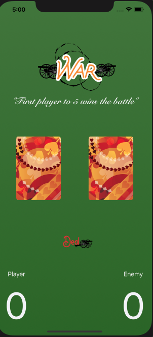

# WarCardGame
Author: Royce Bradley |
The game of war. Cards are drawn at random and the higher card earns a point.

### Running the program

Build and run the project on simulator or iPhone.
Click the deal button. The first player to earn 5 points wins the game.

### Environment

Written with XCode 11.3, targetting iPhone only
